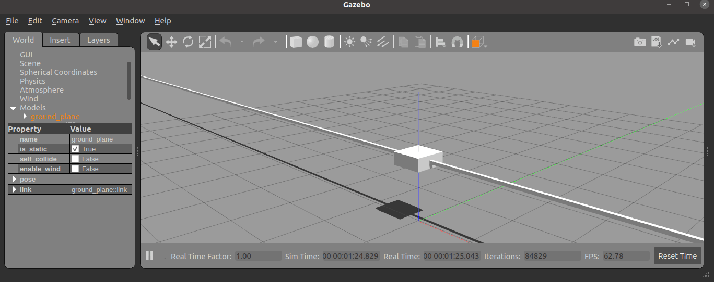

# gazebo_ros2_control

This repository contains the contents for testing gazebo_ros2_control

It is running Gazebo and some other ROS 2 nodes.

## Video + Pictures



## Running

### Modifying or building your own

```bash
cd Docker
docker build -t gazebo_ros2_control_docker .
```

### To run the demo

The following command will launch Gazebo

```bash
rocker --x11 --nvidia gazebo_ros2_control:latest
```

The following commands allow to move the cart in the rail:

```bash
docker exec <rocker name container> bash
ros2 run gazebo_ros2_control_demos example_position
```
