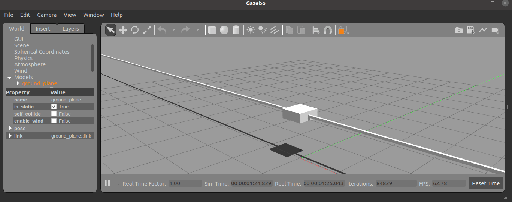
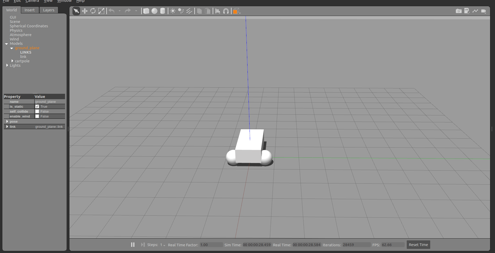
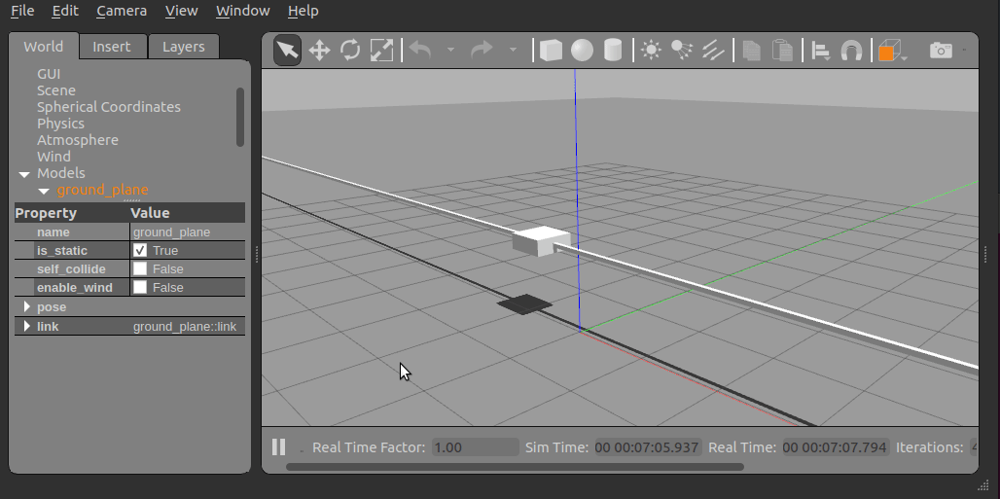
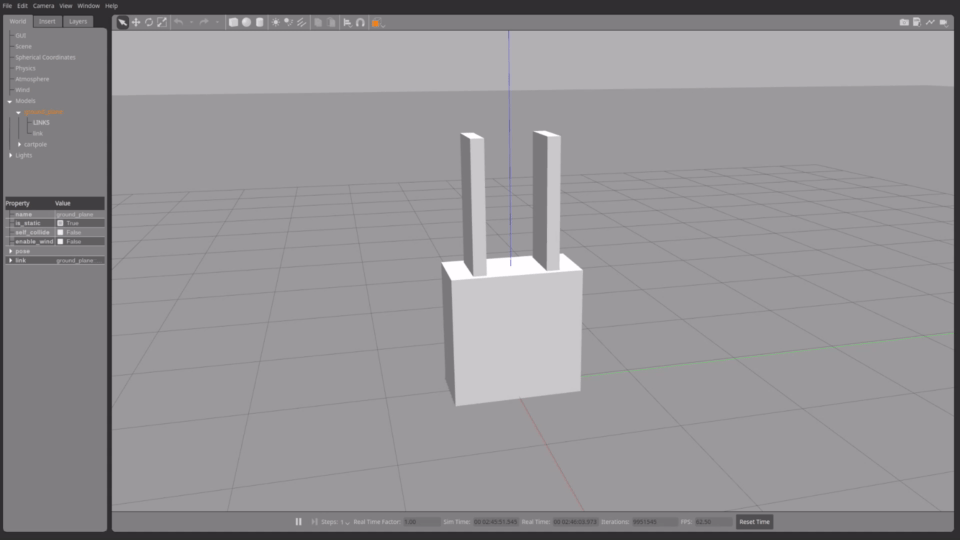

:github_url: https://github.com/ros-controls/gazebo_ros2_control/blob/{REPOS_FILE_BRANCH}/doc/index.rst

.. _gazebo_ros2_control:

=====================
gazebo_ros2_control
=====================

This is a ROS 2 package for integrating the *ros2_control* controller architecture with the `Gazebo Classic <https://classic.gazebosim.org/>`__ simulator.

This package provides a Gazebo plugin which instantiates a *ros2_control* controller manager and connects it to a Gazebo model.

Usage
======

Modifying or building your own
---------------------------------

.. code-block:: shell

  cd Docker
  docker build -t gazebo_ros2_control .

To run the demo
---------------------------------

1. Using Docker

  Docker allows us to run the demo without GUI if we don't configure it properly. The following command runs the demo without GUI:

  .. code-block:: shell

    docker run -it --rm --name gazebo_ros2_control_demo --net host gazebo_ros2_control ros2 launch gazebo_ros2_control_demos cart_example_position.launch.py gui:=false

  The in your local machine you can run the Gazebo Classic client:

  .. code-block:: shell

    gzclient

2. Using Rocker

  To run the demo with GUI we are going to use `rocker <https://github.com/osrf/rocker/>`__ which is a tool to run docker
  images with customized local support injected for things like nvidia support. And user id specific files for cleaner
  mounting file permissions. You can install this tool with the following `instructions <https://github.com/osrf/rocker/#installation>`__.

  The following command will launch Gazebo Classic:

  .. code-block:: shell

    rocker --x11 --nvidia --name gazebo_ros2_control_demo gazebo_ros2_control:latest

  The following commands allow to move the cart in the rail:

  .. code-block:: shell

    docker exec -it gazebo_ros2_control_demo bash
    source /home/ros2_ws/install/setup.bash
    ros2 run gazebo_ros2_control_demos example_position

Add ros2_control tag to a URDF
==========================================

Simple setup
-----------------------------------------------------------

To use *ros2_control* with your robot, you need to add some additional elements to your URDF.
You should include the tag ``<ros2_control>`` to access and control the robot interfaces. We should
include

* a specific ``<plugin>`` for our robot
* ``<joint>`` tag including the robot controllers: commands and states.

.. code-block:: xml

  <ros2_control name="GazeboSystem" type="system">
    <hardware>
      <plugin>gazebo_ros2_control/GazeboSystem</plugin>
    </hardware>
    <joint name="slider_to_cart">
      <command_interface name="effort">
        <param name="min">-1000</param>
        <param name="max">1000</param>
      </command_interface>
      <state_interface name="position">
        <param name="initial_value">1.0</param>
      </state_interface>
      <state_interface name="velocity"/>
      <state_interface name="effort"/>
    </joint>
  </ros2_control>

Using mimic joints in simulation
-----------------------------------------------------------

To use ``mimic`` joints in *gazebo_ros2_control* you should define its parameters to your URDF.
We should include:

* ``<mimic>`` tag to the mimicked joint `detailed manual <https://wiki.ros.org/urdf/XML/joint>`__
* ``mimic`` and ``multiplier`` parameters to joint definition in ``<ros2_control>`` tag

.. code-block:: xml

  <joint name="left_finger_joint" type="prismatic">
    <mimic joint="right_finger_joint"/>
    <axis xyz="0 1 0"/>
    <origin xyz="0.0 0.48 1" rpy="0.0 0.0 3.1415926535"/>
    <parent link="base"/>
    <child link="finger_left"/>
    <limit effort="1000.0" lower="0" upper="0.38" velocity="10"/>
  </joint>

.. code-block:: xml

  <joint name="left_finger_joint">
    <param name="mimic">right_finger_joint</param>
    <param name="multiplier">1</param>
    <command_interface name="position"/>
    <state_interface name="position"/>
    <state_interface name="velocity"/>
    <state_interface name="effort"/>
  </joint>

Add the gazebo_ros2_control plugin
==========================================

In addition to the *ros2_control* tags, a Gazebo plugin needs to be added to your URDF that
actually parses the *ros2_control* tags and loads the appropriate hardware interfaces and
controller manager. By default the *gazebo_ros2_control* plugin is very simple, though it is also
extensible via an additional plugin architecture to allow power users to create their own custom
robot hardware interfaces between *ros2_control* and Gazebo Classic.

.. code-block:: xml

  <gazebo>
      <plugin filename="libgazebo_ros2_control.so" name="gazebo_ros2_control">
        <robot_param>robot_description</robot_param>
        <robot_param_node>robot_state_publisher</robot_param_node>
        <parameters>$(find gazebo_ros2_control_demos)/config/cart_controller.yaml</parameters>
        <controller_manager_name>simulation_controller_manager</controller_manager_name>
      </plugin>
  </gazebo>

The *gazebo_ros2_control* ``<plugin>`` tag also has the following optional child elements:

* ``<robot_param>``: The location of the ``robot_description`` (URDF) on the parameter server, defaults to ``robot_description``
* ``<robot_param_node>``: Name of the node where the ``robot_param`` is located, defaults to ``robot_state_publisher``
* ``<parameters>``: YAML file with the configuration of the controllers
* ``<hold_joints>``: if set to true (default), it will hold the joints' position if their interface was not claimed, e.g., the controller hasn't been activated yet.
* ``<controller_manager_name>``: Set controller manager name (default: ``controller_manager``)

Default gazebo_ros2_control Behavior
-----------------------------------------------------------

By default, without a ``<plugin>`` tag, *gazebo_ros2_control* will attempt to get all of the information it needs to interface with a ros2_control-based controller out of the URDF. This is sufficient for most cases, and good for at least getting started.

The default behavior provides the following ros2_control interfaces:

* hardware_interface::JointStateInterface
* hardware_interface::EffortJointInterface
* hardware_interface::VelocityJointInterface

Advanced: custom gazebo_ros2_control Simulation Plugins
-----------------------------------------------------------

The *gazebo_ros2_control* Gazebo plugin also provides a pluginlib-based interface to implement custom interfaces between Gazebo Classic and *ros2_control* for simulating more complex mechanisms (nonlinear springs, linkages, etc).

These plugins must inherit ``gazebo_ros2_control::GazeboSystemInterface`` which implements a simulated *ros2_control*
``hardware_interface::SystemInterface``. SystemInterface provides API-level access to read and command joint properties.

The respective GazeboSystemInterface sub-class is specified in a URDF model and is loaded when the
robot model is loaded. For example, the following XML will load the default plugin:

.. code-block:: xml

  <ros2_control name="GazeboSystem" type="system">
    <hardware>
      <plugin>gazebo_ros2_control/GazeboSystem</plugin>
    </hardware>
    ...
  <ros2_control>
  <gazebo>
    <plugin name="gazebo_ros2_control" filename="libgazebo_ros2_control.so">
      ...
    </plugin>
  </gazebo>

Set up controllers
-----------------------------------------------------------

Use the tag ``<parameters>`` inside ``<plugin>`` to set the YAML file with the controller configuration.

.. code-block:: xml

  <gazebo>
    <plugin name="gazebo_ros2_control" filename="libgazebo_ros2_control.so">
      <parameters>$(find gazebo_ros2_control_demos)/config/cart_controller.yaml</parameters>
    </plugin>
  <gazebo>

The following is a basic configuration of the controllers:

- ``joint_state_broadcaster``: This controller publishes the state of all resources registered to a ``hardware_interface::StateInterface`` to a topic of type ``sensor_msgs/msg/JointState``.

- ``joint_trajectory_controller``: This controller creates an action called ``/joint_trajectory_controller/follow_joint_trajectory`` of type ``control_msgs::action::FollowJointTrajectory``.

.. literalinclude:: ../gazebo_ros2_control_demos/config/cart_controller.yaml
   :language: yaml

gazebo_ros2_control_demos
==========================================

This package contains the contents for testing gazebo_ros2_control. It is running Gazebo Classic and some other ROS 2 nodes.

There are some examples in the *Gazebo_ros2_control_demos* package. These examples allow to launch a cart in a 30 meter rail.

You can run some of the configuration running the following commands:

.. code-block:: shell

  ros2 launch gazebo_ros2_control_demos cart_example_position.launch.py
  ros2 launch gazebo_ros2_control_demos cart_example_velocity.launch.py
  ros2 launch gazebo_ros2_control_demos cart_example_effort.launch.py
  ros2 launch gazebo_ros2_control_demos diff_drive.launch.py
  ros2 launch gazebo_ros2_control_demos tricycle_drive.launch.py

When the Gazebo world is launched you can run some of the following commands to move the cart.

.. code-block:: shell

  ros2 run gazebo_ros2_control_demos example_position
  ros2 run gazebo_ros2_control_demos example_velocity
  ros2 run gazebo_ros2_control_demos example_effort
  ros2 run gazebo_ros2_control_demos example_diff_drive
  ros2 run gazebo_ros2_control_demos example_tricycle_drive

The following example shows parallel gripper with mimic joint:

.. code-block:: shell

  ros2 launch gazebo_ros2_control_demos gripper_mimic_joint_example.launch.py

Send example commands:

.. code-block:: shell

  ros2 run gazebo_ros2_control_demos example_gripper
